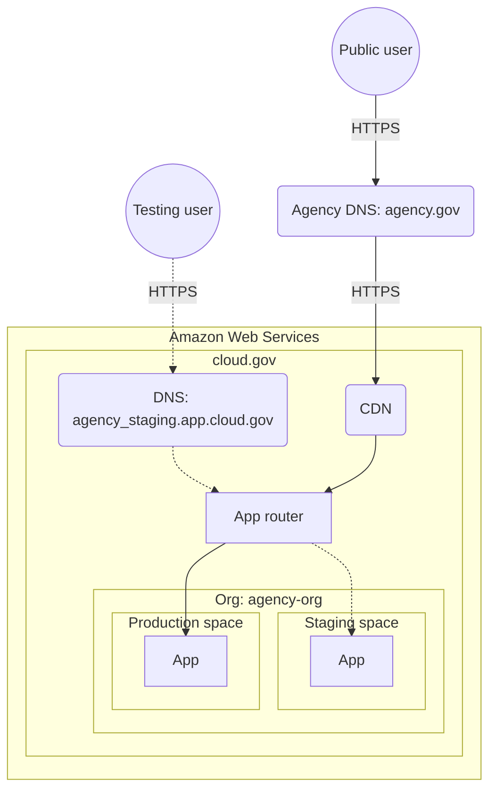

# [.IO](https://code.cloud-technology.io/Automata/.IO) 

**Continuous Integration** & **Development**

> __Proprietary Notice__
>
> The following source file(s) contains confidential, proprietary information. Unauthorized use is strictly prohibited.
> No portions may be accessed, copied, reproduced, or incorporated outside of this domain without Cloud Hybrid (LLC.)'s
> written consent.
>
> Special permissions have been given to Cloud Hybrid LLC.'s established partners and associated namespaces; such 
> permissions are limited to access, usage, and revisioning. Under no circumstances can such namespaces claim ownership
> or copyright the source code created by Cloud Hybrid LLC. or Jacob Sanders. However, usage and further development of
> such source code can continue as long as copyright notices remain and derived applications are limited to internal-use
> only.
>
> Please contact [Jacob B. Sanders](mainto:jacob.sanders@cloudhybrid.io) for further copyright, contact, and
> authorization information.

## Table of Contents ##

[[_TOC_]]

## Usage ##

The only step that's required is to include the `.IO` repository as a *submodule*

- `git submodule add --force https://code.cloud-technology.io/Automata/.IO.git .IO`

## Pipeline Environment Variables ##

<details>
    <summary>
        <strong>
            Variables Table
        </strong>
    </summary>

| Variable                                      | GitLab | Runner | Description                                                                                                                                                                                                                                                                                                                                                |
|-----------------------------------------------|--------|--------|------------------------------------------------------------------------------------------------------------------------------------------------------------------------------------------------------------------------------------------------------------------------------------------------------------------------------------------------------------|
| `CHAT_CHANNEL`                                | 10.6   | all    | Source chat channel which triggered the [ChatOps](../chatops/README.md) command                                                                                                                                                                                                                                                                            |
| `CHAT_INPUT`                                  | 10.6   | all    | Additional arguments passed in the [ChatOps](../chatops/README.md) command                                                                                                                                                                                                                                                                                 |
| `CI`                                          | all    | 0.4    | Mark that job is executed in CI environment                                                                                                                                                                                                                                                                                                                |
| `CI_API_V4_URL`                               | 11.7   | all    | The GitLab API v4 root URL                                                                                                                                                                                                                                                                                                                                 |
| `CI_BUILDS_DIR`                               | all    | 11.10  | Top-level directory where builds are executed.                                                                                                                                                                                                                                                                                                             |
| `CI_COMMIT_BEFORE_SHA`                        | 11.2   | all    | The previous latest commit present on a branch. Is always `0000000000000000000000000000000000000000` in pipelines for merge requests.                                                                                                                                                                                                           |
| `CI_COMMIT_DESCRIPTION`                       | 10.8   | all    | The description of the commit: the message without first line, if the title is shorter than 100 characters; full message in other case.                                                                                                                                                                                                                    |
| `CI_COMMIT_MESSAGE`                           | 10.8   | all    | The full commit message.                                                                                                                                                                                                                                                                                                                                   |
| `CI_COMMIT_REF_NAME`                          | 9.0    | all    | The branch or tag name for which project is built                                                                                                                                                                                                                                                                                                          |
| `CI_COMMIT_REF_PROTECTED`                     | 11.11  | all    | `true` if the job is running on a protected reference, `false` if not                                                                                                                                                                                                                                                                                                               |
| `CI_COMMIT_REF_SLUG`                          | 9.0    | all    | `$CI_COMMIT_REF_NAME` lowercased, shortened to 63 bytes, and with everything except `0-9` and `a-z` replaced with `-`. No leading / trailing `-`. Use in URLs, host names and domain names.                                                                                                                                                                |
| `CI_COMMIT_SHA`                               | 9.0    | all    | The commit revision for which project is built                                                                                                                                                                                                                                                                                                             |
| `CI_COMMIT_SHORT_SHA`                         | 11.7   | all    | The first eight characters of `CI_COMMIT_SHA`                                                                                                                                                                                                                                                                                                              |
| `CI_COMMIT_BRANCH`                            | 12.6   | 0.5    | The commit branch name. Present only when building branches.                                                                                                                                                                                                                                                                                                      |
| `CI_COMMIT_TAG`                               | 9.0    | 0.5    | The commit tag name. Present only when building tags.                                                                                                                                                                                                                                                                                                      |
| `CI_COMMIT_TITLE`                             | 10.8   | all    | The title of the commit - the full first line of the message                                                                                                                                                                                                                                                                                               |
| `CI_COMMIT_TIMESTAMP`                         | 13.4   | all    | The timestamp of the commit in the ISO 8601 format.                                                                                                                                                                                                                                                                                               |
| `CI_CONCURRENT_ID`                            | all    | 11.10  | Unique ID of build execution within a single executor.                                                                                                                                                                                                                                                                                                     |
| `CI_CONCURRENT_PROJECT_ID`                    | all    | 11.10  | Unique ID of build execution within a single executor and project.                                                                                                                                                                                                                                                                                         |
| `CI_CONFIG_PATH`                              | 9.4    | 0.5    | The path to CI configuration file. Defaults to `.gitlab-ci.yml`                                                                                                                                                                                                                                                                                                   |
| `CI_DEBUG_TRACE`                              | all    | 1.7    | Whether [debug logging (tracing)](README.md#debug-logging) is enabled                                                                                                                                                                                                                                                                                      |
| `CI_DEFAULT_BRANCH`                           | 12.4   | all    | The name of the default branch for the project.                                                                                                                                                                                                                                                                                                            |
| `CI_DEPLOY_FREEZE`                            | 13.2   | all    | Included with the value `true` if the pipeline runs during a [deploy freeze window](../../user/project/releases/index.md#prevent-unintentional-releases-by-setting-a-deploy-freeze).                                                                                                                                                                                                                                    |
| `CI_DEPLOY_PASSWORD`                          | 10.8   | all    | Authentication password of the [GitLab Deploy Token](../../user/project/deploy_tokens/index.md#gitlab-deploy-token), only present if the Project has one related.                                                                                                                                                                                                                                    |
| `CI_DEPLOY_USER`                              | 10.8   | all    | Authentication username of the [GitLab Deploy Token](../../user/project/deploy_tokens/index.md#gitlab-deploy-token), only present if the Project has one related.                                                                                                                                                                                                                                    |
| `CI_DISPOSABLE_ENVIRONMENT`                   | all    | 10.1   | Marks that the job is executed in a disposable environment (something that is created only for this job and disposed of/destroyed after the execution - all executors except `shell` and `ssh`). If the environment is disposable, it is set to true, otherwise it is not defined at all.                                                                  |
| `CI_ENVIRONMENT_NAME`                         | 8.15   | all    | The name of the environment for this job. Only present if [`environment:name`](../yaml/README.md#environmentname) is set.                                                                                                                                                                                                                                  |
| `CI_ENVIRONMENT_SLUG`                         | 8.15   | all    | A simplified version of the environment name, suitable for inclusion in DNS, URLs, Kubernetes labels, etc. Only present if [`environment:name`](../yaml/README.md#environmentname) is set.                                                                                                                                                                 |
| `CI_ENVIRONMENT_URL`                          | 9.3    | all    | The URL of the environment for this job. Only present if [`environment:url`](../yaml/README.md#environmenturl) is set.                                                                                                                                                                                                                                     |
| `CI_EXTERNAL_PULL_REQUEST_IID`                | 12.3   | all    | Pull Request ID from GitHub if the [pipelines are for external pull requests](../ci_cd_for_external_repos/index.md#pipelines-for-external-pull-requests). Available only if `only: [external_pull_requests]` or [`rules`](../yaml/README.md#rules) syntax is used and the pull request is open.                                                                                                         |
| `CI_EXTERNAL_PULL_REQUEST_SOURCE_REPOSITORY`  | 13.3   | all    | The source repository name of the pull request if [the pipelines are for external pull requests](../ci_cd_for_external_repos/index.md#pipelines-for-external-pull-requests). Available only if `only: [external_pull_requests]` or [`rules`](../yaml/README.md#rules) syntax is used and the pull request is open.                                                                                          |
| `CI_EXTERNAL_PULL_REQUEST_TARGET_REPOSITORY`  | 13.3   | all    | The target repository name of the pull request if [the pipelines are for external pull requests](../ci_cd_for_external_repos/index.md#pipelines-for-external-pull-requests). Available only if `only: [external_pull_requests]` or [`rules`](../yaml/README.md#rules) syntax is used and the pull request is open.                                                                                          |
| `CI_EXTERNAL_PULL_REQUEST_SOURCE_BRANCH_NAME` | 12.3   | all    | The source branch name of the pull request if [the pipelines are for external pull requests](../ci_cd_for_external_repos/index.md#pipelines-for-external-pull-requests). Available only if `only: [external_pull_requests]` or [`rules`](../yaml/README.md#rules) syntax is used and the pull request is open.                                                                                          |
| `CI_EXTERNAL_PULL_REQUEST_SOURCE_BRANCH_SHA`  | 12.3   | all    | The HEAD SHA of the source branch of the pull request if [the pipelines are for external pull requests](../ci_cd_for_external_repos/index.md#pipelines-for-external-pull-requests). Available only if `only: [external_pull_requests]` or [`rules`](../yaml/README.md#rules) syntax is used and the pull request is open.                                                                               |
| `CI_EXTERNAL_PULL_REQUEST_TARGET_BRANCH_NAME` | 12.3   | all    | The target branch name of the pull request if [the pipelines are for external pull requests](../ci_cd_for_external_repos/index.md#pipelines-for-external-pull-requests). Available only if `only: [external_pull_requests]` or [`rules`](../yaml/README.md#rules) syntax is used and the pull request is open.                                                                                          |
| `CI_EXTERNAL_PULL_REQUEST_TARGET_BRANCH_SHA`  | 12.3   | all    | The HEAD SHA of the target branch of the pull request if [the pipelines are for external pull requests](../ci_cd_for_external_repos/index.md#pipelines-for-external-pull-requests). Available only if `only: [external_pull_requests]` or [`rules`](../yaml/README.md#rules) syntax is used and the pull request is open.                                                                               |
| `CI_HAS_OPEN_REQUIREMENTS`                    | 13.1   | all    | Included with the value `true` only if the pipeline's project has any open [requirements](../../user/project/requirements/index.md). Not included if there are no open requirements for the pipeline's project.                                                                                                                                                                                        |
| `CI_JOB_ID`                                   | 9.0    | all    | The unique ID of the current job that GitLab CI/CD uses internally                                                                                                                                                                                                                                                                                            |
| `CI_JOB_IMAGE`                                | 12.9   | 12.9   | The name of the image running the CI job                                                                                                                                                                                                                                                                                                                   |
| `CI_JOB_MANUAL`                               | 8.12   | all    | The flag to indicate that job was manually started                                                                                                                                                                                                                                                                                                         |
| `CI_JOB_NAME`                                 | 9.0    | 0.5    | The name of the job as defined in `.gitlab-ci.yml`                                                                                                                                                                                                                                                                                                         |
| `CI_JOB_STAGE`                                | 9.0    | 0.5    | The name of the stage as defined in `.gitlab-ci.yml`                                                                                                                                                                                                                                                                                                       |
| `CI_JOB_TOKEN`                                | 9.0    | 1.2    | Token used for authenticating with the [GitLab Container Registry](../../user/packages/container_registry/index.md), downloading [dependent repositories](../../user/project/new_ci_build_permissions_model.md#dependent-repositories), and accessing [GitLab-managed Terraform state](../../user/infrastructure/index.md#gitlab-managed-terraform-state).         |
| `CI_JOB_JWT`                                  | 12.10  | all    | RS256 JSON web token that can be used for authenticating with third party systems that support JWT authentication, for example [HashiCorp's Vault](../secrets/index.md). |
| `CI_JOB_URL`                                  | 11.1   | 0.5    | Job details URL                                                                                                                                                                                                                                                                                                                                            |
| `CI_KUBERNETES_ACTIVE`                        | 13.0   | all    | Included with the value `true` only if the pipeline has a Kubernetes cluster available for deployments. Not included if no cluster is available. Can be used as an alternative to [`only:kubernetes`/`except:kubernetes`](../yaml/README.md#onlykubernetesexceptkubernetes) with [`rules:if`](../yaml/README.md#rulesif)                                    |
| `CI_MERGE_REQUEST_ASSIGNEES`                  | 11.9   | all    | Comma-separated list of username(s) of assignee(s) for the merge request if [the pipelines are for merge requests](../merge_request_pipelines/index.md). Available only if `only: [merge_requests]` or [`rules`](../yaml/README.md#rules) syntax is used and the merge request is created.                                                                                                              |
| `CI_MERGE_REQUEST_ID`                         | 11.6   | all    | The instance-level ID of the merge request. Only available if [the pipelines are for merge requests](../merge_request_pipelines/index.md) and the merge request is created.                                                                                                                                                           |
| `CI_MERGE_REQUEST_IID`                        | 11.6   | all    | The project-level IID (internal ID) of the merge request. Only available If [the pipelines are for merge requests](../merge_request_pipelines/index.md) and the merge request is created.                                                                                                                                                          |
| `CI_MERGE_REQUEST_LABELS`                     | 11.9   | all    | Comma-separated label names of the merge request if [the pipelines are for merge requests](../merge_request_pipelines/index.md). Available only if `only: [merge_requests]` or [`rules`](../yaml/README.md#rules) syntax is used and the merge request is created.                                                                                                                                      |
| `CI_MERGE_REQUEST_MILESTONE`                  | 11.9   | all    | The milestone title of the merge request if [the pipelines are for merge requests](../merge_request_pipelines/index.md). Available only if `only: [merge_requests]` or [`rules`](../yaml/README.md#rules) syntax is used and the merge request is created.                                                                                                                                              |
| `CI_MERGE_REQUEST_PROJECT_ID`                 | 11.6   | all    | The ID of the project of the merge request if [the pipelines are for merge requests](../merge_request_pipelines/index.md). Available only if `only: [merge_requests]` or [`rules`](../yaml/README.md#rules) syntax is used and the merge request is created.                                                                                                                                            |
| `CI_MERGE_REQUEST_PROJECT_PATH`               | 11.6   | all    | The path of the project of the merge request if [the pipelines are for merge requests](../merge_request_pipelines/index.md) (e.g. `namespace/awesome-project`). Available only if `only: [merge_requests]` or [`rules`](../yaml/README.md#rules) syntax is used and the merge request is created.                                                                                                       |
| `CI_MERGE_REQUEST_PROJECT_URL`                | 11.6   | all    | The URL of the project of the merge request if [the pipelines are for merge requests](../merge_request_pipelines/index.md) (e.g. `http://192.168.10.15:3000/namespace/awesome-project`). Available only if `only: [merge_requests]` or [`rules`](../yaml/README.md#rules) syntax is used and the merge request is created.                                                                              |
| `CI_MERGE_REQUEST_REF_PATH`                   | 11.6   | all    | The ref path of the merge request if [the pipelines are for merge requests](../merge_request_pipelines/index.md). (e.g. `refs/merge-requests/1/head`). Available only if `only: [merge_requests]` or [`rules`](../yaml/README.md#rules) syntax is used and the merge request is created.                                                                                                                |
| `CI_MERGE_REQUEST_SOURCE_BRANCH_NAME`         | 11.6   | all    | The source branch name of the merge request if [the pipelines are for merge requests](../merge_request_pipelines/index.md). Available only if `only: [merge_requests]` or [`rules`](../yaml/README.md#rules) syntax is used and the merge request is created.                                                                                                                                           |
| `CI_MERGE_REQUEST_SOURCE_BRANCH_SHA`          | 11.9   | all    | The HEAD SHA of the source branch of the merge request if [the pipelines are for merge requests](../merge_request_pipelines/index.md). Available only if `only: [merge_requests]` or [`rules`](../yaml/README.md#rules) syntax is used, the merge request is created, and the pipeline is a [merged result pipeline](../merge_request_pipelines/pipelines_for_merged_results/index.md). **(PREMIUM)**   |
| `CI_MERGE_REQUEST_SOURCE_PROJECT_ID`          | 11.6   | all    | The ID of the source project of the merge request if [the pipelines are for merge requests](../merge_request_pipelines/index.md). Available only if `only: [merge_requests]` or [`rules`](../yaml/README.md#rules) syntax is used and the merge request is created.                                                                                                                                     |
| `CI_MERGE_REQUEST_SOURCE_PROJECT_PATH`        | 11.6   | all    | The path of the source project of the merge request if [the pipelines are for merge requests](../merge_request_pipelines/index.md). Available only if `only: [merge_requests]` or [`rules`](../yaml/README.md#rules) syntax is used and the merge request is created.                                                                                                                                   |
| `CI_MERGE_REQUEST_SOURCE_PROJECT_URL`         | 11.6   | all    | The URL of the source project of the merge request if [the pipelines are for merge requests](../merge_request_pipelines/index.md). Available only if `only: [merge_requests]` or [`rules`](../yaml/README.md#rules) syntax is used and the merge request is created.                                                                                                                                    |
| `CI_MERGE_REQUEST_TARGET_BRANCH_NAME`         | 11.6   | all    | The target branch name of the merge request if [the pipelines are for merge requests](../merge_request_pipelines/index.md). Available only if `only: [merge_requests]` or [`rules`](../yaml/README.md#rules) syntax is used and the merge request is created.                                                                                                                                           |
| `CI_MERGE_REQUEST_TARGET_BRANCH_SHA`          | 11.9   | all    | The HEAD SHA of the target branch of the merge request if [the pipelines are for merge requests](../merge_request_pipelines/index.md). Available only if `only: [merge_requests]` or [`rules`](../yaml/README.md#rules) syntax is used, the merge request is created, and the pipeline is a [merged result pipeline](../merge_request_pipelines/pipelines_for_merged_results/index.md). **(PREMIUM)**   |
| `CI_MERGE_REQUEST_TITLE`                      | 11.9   | all    | The title of the merge request if [the pipelines are for merge requests](../merge_request_pipelines/index.md). Available only if `only: [merge_requests]` or  [`rules`](../yaml/README.md#rules) syntax is used and the merge request is created.                                                                                                                                                        |
| `CI_MERGE_REQUEST_EVENT_TYPE`                 | 12.3   | all    | The event type of the merge request, if [the pipelines are for merge requests](../merge_request_pipelines/index.md). Can be `detached`, `merged_result` or `merge_train`. |
| `CI_NODE_INDEX`                               | 11.5   | all    | Index of the job in the job set. If the job is not parallelized, this variable is not set.                                                                                                                                                                                                                                                                 |
| `CI_NODE_TOTAL`                               | 11.5   | all    | Total number of instances of this job running in parallel. If the job is not parallelized, this variable is set to `1`.                                                                                                                                                                                                                                    |
| `CI_PAGES_DOMAIN`                             | 11.8   | all    | The configured domain that hosts GitLab Pages.                                                                                                                                                                                                                                                                                                             |
| `CI_PAGES_URL`                                | 11.8   | all    | URL to GitLab Pages-built pages. Always belongs to a subdomain of `CI_PAGES_DOMAIN`.                                                                                                                                                                                                                                                                       |
| `CI_PIPELINE_ID`                              | 8.10   | all    | The instance-level ID of the current pipeline.                                                                                                                                                                                                                                                                                                             |
| `CI_PIPELINE_IID`                             | 11.0   | all    | The project-level IID (internal ID) of the current pipeline.                                                                                                                                                                                                                                                                                               |
| `CI_PIPELINE_SOURCE`                          | 10.0   | all    | Indicates how the pipeline was triggered. Possible options are: `push`, `web`, `schedule`, `api`, `external`, `chat`, `webide`, `merge_request_event`, `external_pull_request_event`, `parent_pipeline`, [`trigger`, or `pipeline`](../triggers/README.md#authentication-tokens) (renamed to `cross_project_pipeline` since 13.0). For pipelines created before GitLab 9.5, this is displayed as `unknown`. |
| `CI_PIPELINE_TRIGGERED`                       | all    | all    | The flag to indicate that job was [triggered](../triggers/README.md)                                                                                                                                                                                                                                                                                       |
| `CI_PIPELINE_URL`                             | 11.1   | 0.5    | Pipeline details URL                                                                                                                                                                                                                                                                                                                                       |
| `CI_PROJECT_DIR`                              | all    | all    | The full path where the repository is cloned and where the job is run. If the GitLab Runner `builds_dir` parameter is set, this variable is set relative to the value of `builds_dir`. For more information, see [Advanced configuration](https://docs.gitlab.com/runner/configuration/advanced-configuration.html#the-runners-section) for GitLab Runner. |
| `CI_PROJECT_ID`                               | all    | all    | The unique ID of the current project that GitLab CI/CD uses internally                                                                                                                                                                                                                                                                                        |
| `CI_PROJECT_NAME`                             | 8.10   | 0.5    | The name of the directory for the project that is currently being built. For example, if the project URL is `gitlab.example.com/group-name/project-1`, the `CI_PROJECT_NAME` would be `project-1`.                                                                                                                                                         |
| `CI_PROJECT_NAMESPACE`                        | 8.10   | 0.5    | The project namespace (username or group name) that is currently being built                                                                                                                                                                                                                                                                                |
| `CI_PROJECT_ROOT_NAMESPACE`                   | 13.2   | 0.5    | The **root** project namespace (username or group name) that is currently being built. For example, if `CI_PROJECT_NAME` is `root-group/child-group/grandchild-group`, `CI_PROJECT_ROOT_NAMESPACE` would be `root-group`.                                                                                                                                  |
| `CI_PROJECT_PATH`                             | 8.10   | 0.5    | The namespace with project name                                                                                                                                                                                                                                                                                                                            |
| `CI_PROJECT_PATH_SLUG`                        | 9.3    | all    | `$CI_PROJECT_PATH` lowercased and with everything except `0-9` and `a-z` replaced with `-`. Use in URLs and domain names.                                                                                                                                                                                                                                  |
| `CI_PROJECT_REPOSITORY_LANGUAGES`             | 12.3   | all    | Comma-separated, lowercased list of the languages used in the repository (e.g. `ruby,javascript,html,css`)                                                                                                                                                                                                                                                 |
| `CI_PROJECT_TITLE`                            | 12.4   | all    | The human-readable project name as displayed in the GitLab web interface.                                                                                                                                                                                                                                                                                  |
| `CI_PROJECT_URL`                              | 8.10   | 0.5    | The HTTP(S) address to access project                                                                                                                                                                                                                                                                                                                      |
| `CI_PROJECT_VISIBILITY`                       | 10.3   | all    | The project visibility (internal, private, public)                                                                                                                                                                                                                                                                                                         |
| `CI_REGISTRY`                                 | 8.10   | 0.5    | If the Container Registry is enabled it returns the address of GitLab's Container Registry. This variable includes a `:port` value if one has been specified in the registry configuration.                                                                                                                                                           |
| `CI_REGISTRY_IMAGE`                           | 8.10   | 0.5    | If the Container Registry is enabled for the project it returns the address of the registry tied to the specific project                                                                                                                                                                                                                                   |
| `CI_REGISTRY_PASSWORD`                        | 9.0    | all    | The password to use to push containers to the GitLab Container Registry, for the current project.                                                                                                                                                                                                                                                                |
| `CI_REGISTRY_USER`                            | 9.0    | all    | The username to use to push containers to the GitLab Container Registry, for the current project.                                                                                                                                                                                                                                                                 |
| `CI_REPOSITORY_URL`                           | 9.0    | all    | The URL to clone the Git repository                                                                                                                                                                                                                                                                                                                        |
| `CI_RUNNER_DESCRIPTION`                       | 8.10   | 0.5    | The description of the runner as saved in GitLab                                                                                                                                                                                                                                                                                                           |
| `CI_RUNNER_EXECUTABLE_ARCH`                   | all    | 10.6   | The OS/architecture of the GitLab Runner executable (note that this is not necessarily the same as the environment of the executor)                                                                                                                                                                                                                        |
| `CI_RUNNER_ID`                                | 8.10   | 0.5    | The unique ID of runner being used                                                                                                                                                                                                                                                                                                                         |
| `CI_RUNNER_REVISION`                          | all    | 10.6   | GitLab Runner revision that is executing the current job                                                                                                                                                                                                                                                                                                   |
| `CI_RUNNER_SHORT_TOKEN`                       | all    | 12.3   | First eight characters of the runner's token used to authenticate new job requests. Used as the runner's unique ID                                                                                                                                                                                                                                         |
| `CI_RUNNER_TAGS`                              | 8.10   | 0.5    | The defined runner tags                                                                                                                                                                                                                                                                                                                                    |
| `CI_RUNNER_VERSION`                           | all    | 10.6   | GitLab Runner version that is executing the current job                                                                                                                                                                                                                                                                                                    |
| `CI_SERVER`                                   | all    | all    | Mark that job is executed in CI environment                                                                                                                                                                                                                                                                                                                |
| `CI_SERVER_URL`                               | 12.7   | all    | The base URL of the GitLab instance, including protocol and port (like `https://gitlab.example.com:8080`)                                                                                                                                                                                                                                                           |
| `CI_SERVER_HOST`                              | 12.1   | all    | Host component of the GitLab instance URL, without protocol and port (like `gitlab.example.com`)                                                                                                                                                                                                                                                           |
| `CI_SERVER_PORT`                              | 12.8   | all    | Port component of the GitLab instance URL, without host and protocol (like `3000`)                                                                                                                                                                                                                                                                         |
| `CI_SERVER_PROTOCOL`                          | 12.8   | all    | Protocol component of the GitLab instance URL, without host and port (like `https`)                                                                                                                                                                                                                                                                        |
| `CI_SERVER_NAME`                              | all    | all    | The name of CI server that is used to coordinate jobs                                                                                                                                                                                                                                                                                                      |
| `CI_SERVER_REVISION`                          | all    | all    | GitLab revision that is used to schedule jobs                                                                                                                                                                                                                                                                                                              |
| `CI_SERVER_VERSION`                           | all    | all    | GitLab version that is used to schedule jobs                                                                                                                                                                                                                                                                                                               |
| `CI_SERVER_VERSION_MAJOR`                     | 11.4   | all    | GitLab version major component                                                                                                                                                                                                                                                                                                                             |
| `CI_SERVER_VERSION_MINOR`                     | 11.4   | all    | GitLab version minor component                                                                                                                                                                                                                                                                                                                             |
| `CI_SERVER_VERSION_PATCH`                     | 11.4   | all    | GitLab version patch component                                                                                                                                                                                                                                                                                                                             |
| `CI_SHARED_ENVIRONMENT`                       | all    | 10.1   | Marks that the job is executed in a shared environment (something that is persisted across CI invocations like `shell` or `ssh` executor). If the environment is shared, it is set to true, otherwise it is not defined at all.                                                                                                                            |
| `GITLAB_CI`                                   | all    | all    | Mark that job is executed in GitLab CI/CD environment                                                                                                                                                                                                                                                                                                         |
| `GITLAB_FEATURES`                             | 10.6   | all    | The comma separated list of licensed features available for your instance and plan                                                                                                                                                                                                                                                                         |
| `GITLAB_USER_EMAIL`                           | 8.12   | all    | The email of the user who started the job                                                                                                                                                                                                                                                                                                                  |
| `GITLAB_USER_ID`                              | 8.12   | all    | The ID of the user who started the job                                                                                                                                                                                                                                                                                                                     |
| `GITLAB_USER_LOGIN`                           | 10.0   | all    | The login username of the user who started the job                                                                                                                                                                                                                                                                                                         |
| `GITLAB_USER_NAME`                            | 10.0   | all    | The real name of the user who started the job                                                                                                                                                                                                                                                                                                              |

</details>

## References ##

### Automation & Deployments ###

***Please Note*** - The *Discord-Bot Template* comes with automation pre-configured.
However, for personal reference & as a professional recommendation, **reading the following
information is strongly recommended.**

> *Automation*, or more specifically ***CI/CD***, is a tool built for software development
> through **continuous methodologies** - i.e. *Pipelines*.
> 
> - Continuous Integration (CI)
> - Continuous Delivery (CD)
> - Continuous Deployment (CD) 
>
> 

### Introduction ###

- [YouTube Overview](https://www.youtube.com/watch?v=l5705U8s_nQ&t=397)
- [GitLab Documentation](https://docs.gitlab.com/ee/ci/)
    - [Overview](https://docs.gitlab.com/ee/ci/)
    - [Introduction](https://docs.gitlab.com/ee/ci/introduction/)
    - [`.gitlab-ci.yml` Reference](https://docs.gitlab.com/ee/ci/yaml/README.html)

#### Overview ####
##### Continuous Integration #####

Consider an application that has its code stored in a Git repository in GitLab. Developers push code changes every day, 
multiple times a day. For every push to the repository, a set of scripts & *container applications*
(*microservices*) can manage the application **automatically**, decreasing the chance of introducing errors,
and establishing automated best practices.

Such a practice is known as Continuous Integration; for every change submitted to an application - even to development 
branches - it’s built and tested automatically and continuously, ensuring the introduced changes pass all tests, 
guidelines, and code compliance standards.

##### Continuous Delivery #####

Continuous Delivery is a step beyond Continuous Integration. An application is not only built and tested at every 
code change pushed to the codebase, but, as an additional step, it’s also deployed continuously, though the deployments 
are triggered manually.

This method ensures the code is checked automatically but requires human intervention to manually and strategically 
trigger the deployment of the changes.

##### Continuous Deployment #####

Continuous Deployment is also a further step beyond Continuous Integration, similar to Continuous Delivery. 
The difference is that instead of deploying an application manually, users set it to be deployed automatically. It 
does not require human intervention at all to have an application deployed.

##### Implementation & Usage #####

To use GitLab CI/CD, all needed is an application codebase hosted in a
Git repository, and for each build, test, and deployment
scripts to be specified in a file called `.gitlab-ci.yml`,
located in the root path of your repository.

Once a `.gitlab-ci.yml` configuration file is added to the repository, 
GitLab will detect it and run your scripts with the
tool called [GitLab Runner](https://docs.gitlab.com/runner/), which
works similarly to the terminal.

The scripts are grouped into **jobs**, and together they compose
a **pipeline**. A minimalist example of `.gitlab-ci.yml` file
could contain:

```yaml
before_script:
  - apt-get install rubygems ruby-dev -y

run-test:
  script:
    - ruby --version
```

The `before_script` attribute would install the dependencies
for the app before running anything, and a  **job** called
`run-test` would print the Ruby version of the current system.
Both of them compose a **pipeline** triggered at every push
to any branch of the repository.

GitLab CI/CD not only executes the jobs you've
set but also shows you what's happening during execution, as you
would see in your terminal:


You create the strategy for your app and GitLab runs the pipeline according to 
what has been defined. A pipeline status is also displayed by GitLab:


At the end, if anything goes wrong,

 

all the changes can be reverted back to a previous state:


##### Workflows #####

These *Pipelines* allow developers to automate deployments between git commits & updates;
never needing to individually setup infrastructure, external servers, etc.

[GitLab](https://docs.gitlab.com/ee/ci/README.html) is a `git`-based version control system with
additional functions & abilities; namely, "Pipelines" -- the Continuous Integration
& Continuous Deployment/Delivery components aforementioned. 

GitLab CI/CD is capable of doing a lot more what is shown in the CICD figure(s) above, but such a workflow exemplifies 
GitLab’s ability to track the entire process, without the need for an external tool to deliver software. And, most 
usefully, developers can visualize all the steps through the GitLab UI.

#### [CI-Templates](https://gitlab.com/gitlab-org/gitlab/tree/master/lib/gitlab/ci/templates) ####

```bash
export SOURCE="https://gitlab.com/gitlab-org/gitlab/-/archive/master/gitlab-master.zip?path=lib/gitlab/ci/templates"

curl --output ./CI-Templates.zip --url "${SOURCE}" \
    && unzip CI-Templates.zip \
        && mv gitlab*/lib/gitlab/ci/templates CI-Templates

rm -r -f gitlab* && exit 0
```

---

### Modules ###

#### Add ####

```bash
export MODULE_RE2="https://github.com/google/re2.git"
export MODULE_REGEX="https://code.cloud-technology.io/CICD/Commit-Regular-Expressions.git"
export MODULE_GITIGNORE="https://github.com/github/gitignore.git Applications/Git-Management/Git-Ignore.git"

git submodule add --force "${MODULE_REGEX}" \
    Regular-Expressions/Commit-Regular-Expressions

git submodule add --force "${MODULE_GITIGNORE}" \
    Applications/Git-Management/Git-Ignore

git submodule add --force "${MODULE_RE2}" \
    Regular-Expressions/re2
```

#### Remove ####

```bash
git submodule deinit --force --all
```

#### Update ####

```bash
git submodule sync --recursive
git submodule update --init --remote --recursive --force
```

---

### Nested Graphs ###



---

### Regular Expressions ###

#### Patterns Table ####

| Pattern | Description | Alias(es) |
| ------ | ------ | ------ |
| **Revert**,    `U` | Reverts a previous commit | `[U]ndo`, `Reversion`, `Reverted`, `Mistake` |
| **Fix**,       `B` | Work towards bug-related code | `[B]ugfix`, `Bug-Fix`, `Hot-Fix`, `Hotfix` |
| **[F]eature**, `F` | **Creation** of a capability: implementation of a dependency, test, functionality | `Add`, `Added`, `Addition`, `Implementation` `Implemented` |
| **Bump**,      `V` | **Increase version**; i.e. updating a dependency | `[V]ersion`, `Release` |
| **[T]est**,    `T` | *Additions* or *refactoring* of anything **test-related** | `Unit`, `Interoperability`, `Stage` |
| **[B]uild**,   `B` | Build effects to *compilation or external dependencies* | *Not Applicable* |
| **No-Build**,  `X` | Build effects to *compilation or external dependencies* | *Not Applicable* |
| **C[I]**,      `I` | *Changes to CI configuration files and scripts* | *Under Further Consideration* |
| **[R]efactor**,`R` | A code change that **neither** fixes a *bug* nor adds a *feature* | `Refactoring`|
| **[S]tyle**,   `S` | Deprivation of _Refactor_ - *white space, semi-colons, etc* | `Styling`, `Styles`, `Markup` |
| **[O]ptimize**,`O` | Deprivation of _Refactor_ - *runtime, build optimizations* | `Optimizing`, `Optimization` | 
| **[D]ocument**,`D` | Deprivation of _Refactor_ - *code documentation* | `Documentation`, `README`, `Information`, `ILC`, `In-Line-Comment`, `In-Line-Comments`, `Clarification` |

#### Pipeline ####

[Regular-Expression Example](./Documentation/Regular-Expressions/CICD-Template.Yaml)
```yaml
# - - - - - - - - - - - - - - -
# Regular Expression Triggers
# - - - - - - - - - - - - - - -

.Regular-Expressions: &Trigger
    -   if:     "$CI_PIPELINE_SOURCE == 'api'"
    -   if:     "$CI_PIPELINE_SOURCE == 'chat'"
    -   if:     "$CI_PIPELINE_SOURCE == 'external'"
    -   if:     "$CI_PIPELINE_SOURCE == 'external_pull_request_event'"
    -   if:     "$CI_PIPELINE_SOURCE == 'merge_request_event'"
    -   if:     "$CI_PIPELINE_SOURCE == 'parent_pipeline'"
    -   if:     "$CI_PIPELINE_SOURCE == 'pipeline'"
    -   if:     "$CI_PIPELINE_SOURCE == 'push'"
    -   if:     "$CI_PIPELINE_SOURCE == 'schedule'"
    -   if:     "$CI_PIPELINE_SOURCE == 'trigger'"
    -   if:     "$CI_PIPELINE_SOURCE == 'web'"
    -   if:     "$CI_PIPELINE_SOURCE == 'webide'"
    -   if:     "$CI_COMMIT_BRANCH =~ /^(Production)?(-|:)?($)?(.*)/imU"
    -   if:     "$CI_COMMIT_BRANCH =~ /^(Prod)?(-|:)?($)?(.*)/imU"
    -   if:     "$CI_COMMIT_BRANCH =~ /^(Master)?(-|:)?($)?(.*)/imU"
    -   if:     "$CI_COMMIT_BRANCH =~ /^(UAT)?(-|:)?($)?(.*)/imU"
    -   if:     "$CI_COMMIT_BRANCH =~ /^(Certification)?(-|:)?($)?(.*)/imU"
    -   if:     "$CI_COMMIT_BRANCH =~ /^(Certificate)?(-|:)?($)?(.*)/imU"
    -   if:     "$CI_COMMIT_BRANCH =~ /^(Cert)?(-|:)?($)?(.*)/imU"
    -   if:     "$CI_COMMIT_BRANCH =~ /^(Quality-Assurance)?(-|:)?($)?(.*)/imU"
    -   if:     "$CI_COMMIT_BRANCH =~ /^(QA)?(-|:)?($)?(.*)/imU"
    -   if:     "$CI_COMMIT_BRANCH =~ /^(Testing)?(-|:)?($)?(.*)/imU"
    -   if:     "$CI_COMMIT_BRANCH =~ /^(Test)?(-|:)?($)?(.*)/imU"
    -   if:     "$CI_COMMIT_BRANCH =~ /^(Development)?(-|:)?($)?(.*)/imU"
    -   if:     "$CI_COMMIT_BRANCH =~ /^(Develop)?(-|:)?($)?(.*)/imU"
    -   if:     "$CI_COMMIT_BRANCH =~ /^(Dev)?(-|:)?($)?(.*)/imU"
        when:   manual
    -   if:     "$CI_COMMIT_MESSAGE =~ /Manual.*/U"
        when:   manual
    -   if:     "$CI_COMMIT_BRANCH == $CI_DEFAULT_BRANCH"
    -   if:     "$CI_COMMIT_MESSAGE =~ /No-Build.*/iU"
        when:   never
    -   if:     "$CI_COMMIT_MESSAGE =~ /Build.*/iU"
        when:   always

.Regular-Expressions: &Build
    -   if:     "$CI_COMMIT_MESSAGE =~ /No-Build.*/iU"
        when:   never
    -   if:     "$CI_COMMIT_MESSAGE =~ /Build.*/iU"
        when:   always

.Regular-Expressions: &Never
    -   if:     "$CI_PIPELINE_SOURCE == 'push'"
        when:   never
    -   if:     "$CI_PIPELINE_SOURCE == 'web'"
        when:   never
    -   if:     "$CI_PIPELINE_SOURCE == 'merge_request_event'"
        when:   never

.Regular-Expressions: &Releasing
    -   if:     "$CI_COMMIT_TAG"
        when:   never   # --> Never Run on Manual Release(s)
    -   if:     "$CI_COMMIT_BRANCH == $CI_DEFAULT_BRANCH"

.Regular-Expressions: &Tag
    -   if:     "$CI_COMMIT_TAG"
        when:   always  # --> Always Run on Manual, New Tags

.Regular-Expressions: &Branch
    -   if:     "$CI_COMMIT_BRANCH"
        when:   always  # --> Always Run on Branch Pushes

.Regular-Expressions: &Master
    -   if:     "$CI_COMMIT_BRANCH == 'master'"
        when:   always  # --> Always Run if Push on `master` Branch

.Regular-Expressions: &Default
    -   if:     "$CI_COMMIT_BRANCH == $CI_DEFAULT_BRANCH"
        when:   always  # --> Always Run if Push on `DEFAULT` Branch
```

#### Jira Commit Message ####
```regexp
/((Ticket?(\-))([1-9][0-9]*)|((Feat|Fix|Chore|Refactor|Style|Test|Docs)(-|\ |)(\((\w{0,15})\))?))?(\:?(\ ))(.*\S.*)/gmi
```

[Status]: https://code.cloud-technology.io/Automata/Badge-Generator/-/blob/master/Status/Status-Online.svg

[Environment]: https://code.cloud-technology.io/Automata/Badge-Generator/-/blob/master/Environment/POSIX-Blue.svg

[Language]: https://code.cloud-technology.io/Automata/Badge-Generator/-/blob/master/Language/Python-3-Light-Green.svg

[Release]: https://code.cloud-technology.io/Automata/Badge-Generator/-/blob/master/Release/Alpha-Grey.svg